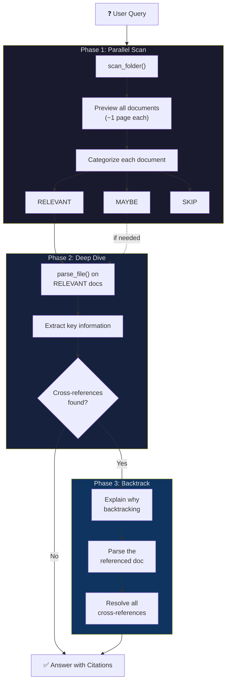
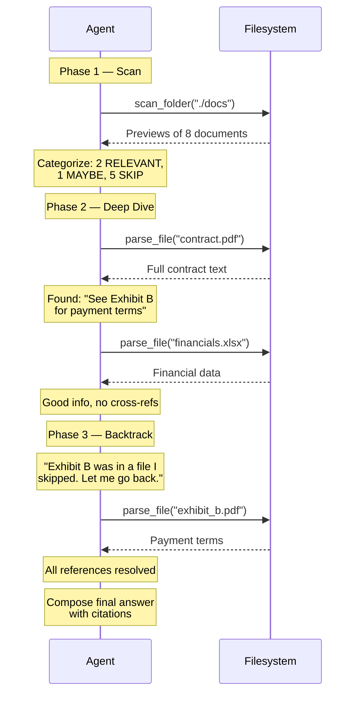
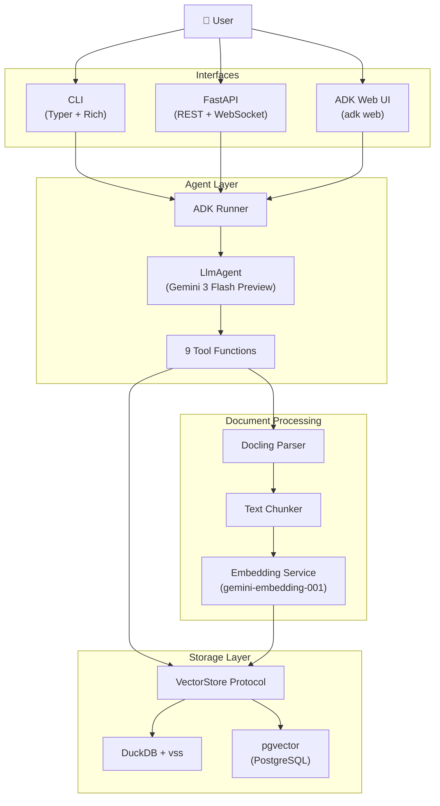
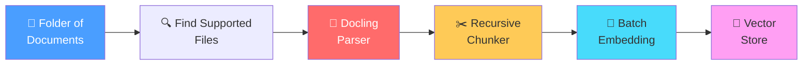
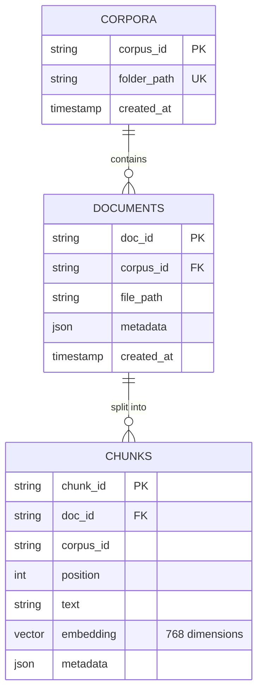

Traditional RAG has served us well. Upload your documents, chunk them, embed them, and retrieve the top-k closest matches when a user asks a question. It works. But if you've built enough RAG pipelines, you know the frustration: traditional RAG is blind. It doesn't understand document structure. It can't follow a cross-reference from a contract to its exhibits. It doesn't know which files in a folder are even worth reading.

I wanted something better. Something that behaves less like a search engine and more like a human researcher — someone who can skim through a stack of papers, figure out which ones matter, deep-dive into the relevant ones, and follow references when they find something interesting.

So I built **Agentic File Query**: an AI-powered document search system that replaces the fixed retrieve-and-generate pipeline with an autonomous agent that reasons about what to read and when.


## Source Code

The complete source code is available on GitHub:
[Agentic File Query](https://github.com/sabit-shaikholla/agentic-file-query)

## The Problem with Traditional RAG

Let me paint a picture. You have a folder with 20 documents — contracts, exhibits, financial reports, spreadsheets. You ask: *"What is the purchase price and what are the payment terms?"*

Traditional RAG will:
1. Embed your question
2. Find the top 5 most similar chunks across all documents
3. Feed those chunks to the LLM
4. Hope that the answer is somewhere in those chunks

But what if the contract says *"See Exhibit B for payment terms"*? Traditional RAG has no idea what Exhibit B is. It can't follow that reference. It retrieves chunks based on semantic similarity alone, with zero understanding of document relationships.

This is the fundamental limitation: **traditional RAG has no agency**. It can't decide what to read, when to stop, or when to go back and check something it missed. It's a one-shot pipeline.

## The Agentic Approach: Scan → Deep Dive → Backtrack

Instead of a fixed retrieval pipeline, I built this as an **agent** — powered by Google's Agent Development Kit (ADK) and Gemini 3 Flash Preview. The agent has 9 tools at its disposal and follows a three-phase exploration strategy modeled on how a human researcher works:



### Phase 1: Parallel Scan

When the agent encounters a folder, it starts by calling `scan_folder()`. This processes every document in parallel, generating a quick preview (~1 page) of each. Think of it as quickly flipping through a stack of papers to see what's there.

After scanning, the agent categorizes each document:
- **RELEVANT** — clearly related to the user's question. Gets a full read.
- **MAYBE** — could be relevant. The agent keeps these in mind.
- **SKIP** — not relevant. The agent moves on.

This is a big efficiency win. Instead of blindly parsing every single document (Docling needs time to process PDFs), the agent focuses its effort where it matters.

### Phase 2: Deep Dive

Next, the agent calls `parse_file()` on documents marked as RELEVANT. This returns the complete document content as markdown.

While reading, the agent is explicitly instructed to watch for cross-references — things like *"See Exhibit A/B/C…"*, *"As stated in the Purchase Agreement…"*, document numbers, exhibit labels, and filenames. This is something traditional RAG completely misses. Cross-references are everywhere in legal documents, financial reports, and technical specs.

### Phase 3: Backtrack

This is where it gets interesting. If the agent finds a cross-reference to a document it previously skipped, it backtracks:

1. Explains _why_ it's going back (*"Found a reference to Schedule B — need to check it"*)
2. Parses the referenced document
3. Continues until all relevant cross-references are resolved



This backtracking capability is what makes the system fundamentally different from traditional RAG. The agent isn't stuck with whatever chunks the retriever happened to find — it actively navigates the document space.

## The 9 Tools

The agent comes equipped with 9 tools, split into two groups:

### Filesystem Tools (Always Available)

| Tool | What It Does |
|------|-------------|
| `scan_folder` | Previews all documents in a folder in parallel |
| `preview_file` | Quick look at a single file (~2-3 pages) |
| `parse_file` | Full document content via Docling |
| `read_text` | Read a plain text file directly |
| `grep_search` | Regex search within a file |
| `find_files` | Glob pattern matching in a directory |

### Vector Search Tools (Require an Index)

| Tool | What It Does |
|------|-------------|
| `semantic_search` | Cosine similarity search on indexed chunks |
| `get_indexed_document` | Full text of an indexed document by ID |
| `list_indexed_documents` | Lists all indexed documents |

The vector search tools light up only after you've run the ingestion pipeline on a folder. If no index exists, they gracefully tell the agent to fall back to filesystem tools. The agent seamlessly switches between strategies — if you've indexed your documents, searches start with semantic retrieval; if not, the agent does the full scan → dive → backtrack flow.

## Architecture

Here's how the pieces fit together:



The system has four layers:

1. **Interfaces** — Three ways in: a CLI built with Typer and Rich, a FastAPI server with WebSocket streaming for real-time events, and the built-in ADK Web UI (`adk web`).

2. **Agent Layer** — The ADK `Runner` creates sessions and manages the agent lifecycle. The `LlmAgent` is powered by Gemini 3 Flash Preview, with a system prompt that encodes the three-phase strategy. The 9 tool functions are defined as simple Python functions that ADK automatically exposes to the model.

3. **Document Processing** — Docling handles the heavy lifting of parsing PDFs, DOCX, PPTX, XLSX, HTML, and Markdown into clean markdown text. A recursive character splitter chunks the content (1000 chars, 200 overlap), and Google's `gemini-embedding-001` generates 768-dimensional vectors.

4. **Storage Layer** — Built around a Python `Protocol` (basically an interface), so swapping backends is a one-line `.env` change. DuckDB is the zero-setup default for local dev; pgvector on PostgreSQL is the production option.

## The Ingestion Pipeline

Before the agent can use semantic search, documents need to be indexed. The pipeline follows a four-step process:



**Parsing** — Docling converts any supported format to clean markdown. The parser maintains a thread-safe cache keyed by `filepath:mtime`, so re-parsing the same file is instant.

**Chunking** — A recursive character splitter that tries paragraph boundaries first (`\n\n`), then newlines, sentences, words, and finally hard character splits as a last resort. The 200-character overlap ensures information at chunk boundaries is captured from both sides.

**Embedding** — Google's `gemini-embedding-001` generates 768-dimensional vectors. The service handles batching automatically (100 texts per API call), and auto-detects whether to use an API key or Vertex AI credentials.

**Storing** — Each file gets a stable `doc_id` (SHA-256 of the path), so re-indexing a folder is idempotent — it just updates existing records.

## Swappable Storage Backends

I didn't want to lock the project into one database. The storage layer is built around a Python `Protocol` — a contract that says *"if you implement these methods, you're a valid vector store."*



Both backends share this three-table schema. Switching is a one-line change:

| Backend | Best For | Setup |
|---------|----------|-------|
| **DuckDB** | Local dev, prototyping | Zero setup — data stored in a single `.duckdb` file |
| **pgvector** | Production, multi-user | Docker, Supabase, or Cloud SQL — just change the connection string |

## Why Google ADK?

Google's Agent Development Kit gave me a lot for free: tool calling, session management, the `adk web` dev UI, and tight integration with Gemini models. Using ADK means the agent works out of the box with `adk run` and `adk web`, while also being fully programmable via the Runner for the CLI and FastAPI server.

ADK's tool system is particularly elegant. Each tool is just a Python function with type hints — ADK inspects the signature, generates the function declaration for the model, handles the JSON marshalling, and routes the responses. No boilerplate, no adapters.

## Why Docling?

I needed something that could handle messy real-world documents — scanned PDFs, DOCX files with weird formatting, PPTX slide decks, Excel spreadsheets. Docling handles all of these and outputs clean markdown. It's not the fastest parser out there, but the quality is consistently good, and that's what matters when the agent needs to reason about document content.

## Running It

The system offers multiple interfaces:


```bash
# CLI — Full agent search
uv run explore explore --task "What is the purchase price?" --folder ./data/docs/

# CLI — Pre-index documents for semantic search
uv run explore index --folder ./data/docs/

# CLI — Direct vector search (skips the agent)
uv run explore search --query "purchase price" --folder ./data/docs/

# ADK Web UI
uv run adk web src/agentic_file_query --port 8000

# FastAPI server with WebSocket streaming
uv run uvicorn agentic_file_query.server:app --host 127.0.0.1 --port 8000
```

The CLI uses Rich for color-coded output, showing each tool call step-by-step as the agent reasons through the documents. The FastAPI server's WebSocket endpoint streams every agent event in real time — tool calls, responses, intermediate reasoning, and the final answer — so you can build a live UI on top of it.

## Key Takeaways

Building this project reinforced a few convictions:

- **Agentic > fixed pipelines** for complex document tasks. When you need multi-hop reasoning, cross-reference following, or intelligent file selection, giving the LLM agency to decide what to read changes everything.

- **The backtracking phase is critical.** Without it, the agent is just a fancy scanner. The ability to recognize *"I skipped something important"* and go back is what makes this feel like a real researcher.

- **Protocol-based abstractions pay off.** The VectorStore protocol meant I could build with DuckDB for local dev and switch to pgvector for production without touching any other code. This saved real time.

- **ADK is remarkably ergonomic.** Defining tools as plain Python functions, getting a web UI for free, and having the runner handle session management — it let me focus on the interesting parts (the strategy, the tools, the pipeline) instead of building framework glue.

The agentic approach isn't a replacement for traditional RAG everywhere. For simple, well-structured knowledge bases, classic RAG is perfectly fine. But for real-world document exploration — the kind where documents reference each other, structure matters, and you don't know upfront which files are relevant — an agent that can think, explore, and backtrack is a fundamentally better paradigm.

## Technical Stack

- **Agent Framework**: Google ADK (Agent Development Kit)
- **LLM**: Gemini 3 Flash Preview
- **Embeddings**: gemini-embedding-001 (768d)
- **Document Parsing**: Docling
- **Vector Storage**: DuckDB (local) / pgvector (production)
- **CLI**: Typer + Rich
- **Server**: FastAPI + WebSocket
- **Language**: Python 3.12+
