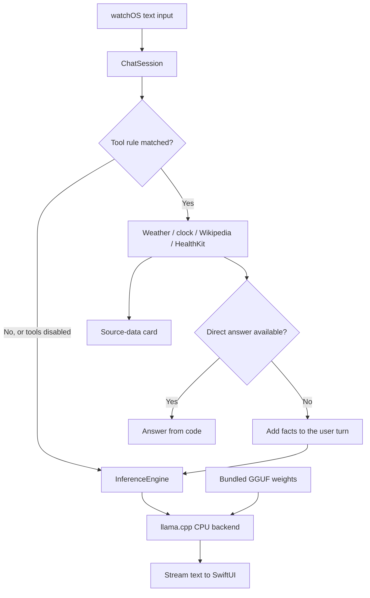
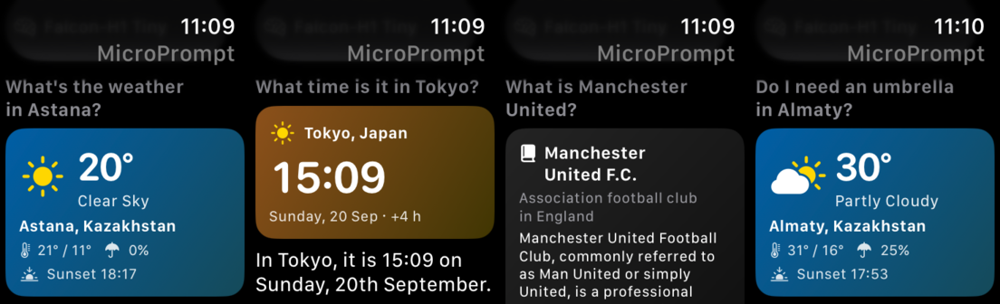

I wanted to see whether I could run a small language model on my Apple Watch. I have a first-generation SE, with an S5 chip, two CPU cores, 1 GB of shared RAM, and watchOS 10. It's fairly limited hardware for this, but the models I wanted to try were only a few hundred megabytes each.

The result is **MicroPrompt**, a SwiftUI app that loads the model on the watch and generates responses there, without sending prompts to a phone or server. It supports short conversations, streams the answer as it's generated, and has a few tools for weather, time, Wikipedia, and health data.

It's still an experiment. The models make mistakes, and there's a noticeable wait before an answer starts. Here's what went into getting it running.

<figure>
  <video controls playsinline preload="none" poster="/images/microprompt/demo-poster.png" width="280" style="display: block; max-width: 100%; margin: auto;" aria-label="MicroPrompt demo: LFM2.5 answering a request on an Apple Watch">
    <source src="/images/microprompt/demo.mp4" type="video/mp4">
    <a href="/images/microprompt/demo.mp4">Watch the MicroPrompt demo.</a>
  </video>
  <figcaption>LFM2.5 responding to a request for a Python script on the watch.</figcaption>
</figure>

[Source code and installation instructions](https://github.com/sabit-shaikholla/microprompt)

## How the app works

The inference engine is written in Swift and wraps [llama.cpp](https://github.com/ggml-org/llama.cpp). The models are bundled as GGUF files, and inference runs entirely on the CPU. I'm not using Metal or the Neural Engine.



`ChatSession` manages the conversation and UI state on the main actor. Inference runs on a serial background queue so the interface stays responsive. I also share the code in `Core/` with a Mac command-line tool. That lets me test things like prompt templates and cache reuse without installing a new build on the watch each time.

I chose llama.cpp because it supports the different model architectures I wanted to try. Core ML would need a separate implementation, and its stateful `MLState` API requires watchOS 11, which this watch doesn't support. I haven't compared their performance.

Although inference is local, some other features need a connection. Weather and Wikipedia use the network, and dictation is handled by watchOS. The **Tools** toggle disables the app's lookups; it doesn't change how watchOS handles dictation.

## Getting llama.cpp to build for the S5

One issue was the watch's architecture name. The S5 uses `arm64_32`: 64-bit ARM instructions with 32-bit pointers. In the llama.cpp revision I pinned, ggml checked for exactly `arm64` before enabling its ARM/NEON code. That left the watch build using portable C kernels instead.

The fix was to include `arm64_32` in that check:

```cmake
# Before
CMAKE_OSX_ARCHITECTURES STREQUAL "arm64"

# After
CMAKE_OSX_ARCHITECTURES MATCHES "^arm64"
```

The CPU target also needs care. Compiling for a newer chip can produce dot-product or matrix instructions that the S5 can't execute. To check for this, the build script disassembles the CPU backend, looks for NEON floating-point instructions, and rejects a list of unsupported instructions. I still need to test the resulting build on the watch, but this catches some problems earlier.

The other build changes were disabling subprocess support (`posix_spawn` isn't available on watchOS), exposing the BSD definitions ggml needs, and force-loading the static CPU backend so the linker keeps its registration code. These are in the [build script](https://github.com/sabit-shaikholla/microprompt/blob/main/scripts/build-llama.sh).

## Models and memory

The default bundle includes three models, all with Q4_0 weight quantization:

| Model | Weight file | SE generation speed |
|---|---:|---:|
| Falcon-H1-Tiny-90M-Instruct | 57 MB | 16–20 tokens/s (estimated) |
| SmolLM2-135M-Instruct | 92 MB | 12.6 tokens/s (measured) |
| LFM2.5-350M | 219 MB | 6.7 tokens/s (measured) |

Falcon is the default, though its speed here is still an estimate from Mac results and the other models' watch-to-Mac ratios. I need a confirmed watch measurement for it.

The models have different architectures. SmolLM2 is a conventional transformer, Falcon combines Mamba and attention, and LFM2.5 combines convolution and attention. This affects how I can reuse their cached state between messages.

The watch configuration uses a 1,024-token context, batches of 32 prompt tokens, up to two CPU threads, and an F16 KV cache. Quantization keeps the weight files small, but the context, working buffers, and UI also need memory. Only part of the watch's 1 GB is available to the app.

## Reducing prompt processing

Before a model generates anything, it has to process the prompt, including the conversation history. This step, called prefill, accounts for some of the delay before the first token appears.

I process prompt tokens in batches rather than one at a time, requesting logits only for the last token in each batch. Larger batches used more memory without helping much in my Mac tests: increasing Falcon's batch size from 32 to 128 grew scratch memory from about 4.3 MB to 17.3 MB, with almost no improvement in prompt throughput. I kept 32 as the default, though the watch still needs its own batch-size comparison.

The engine also reuses cached tokens. If the new prompt extends what's already cached, it only processes the new tokens. When the prompt changes earlier in the conversation, an attention cache can usually be trimmed back to the matching prefix.

That gets more complicated with the hybrid models. Their recurrent state can't be trimmed in the same way. For those, I keep an in-memory checkpoint after the stable system prefix. If trimming fails, the engine tries restoring that checkpoint and aligning the attention cache with it. If neither works, it processes the prompt again from scratch.

On the UI side, I send text updates about every 120 ms instead of updating the layout for each token. Generation pauses between tokens when the app becomes inactive and can resume if the process is still alive. A pause request doesn't interrupt prefill, and the app doesn't keep generating in the background.

## Adding tools

The app can get weather from Open-Meteo, look up the time in another city, fetch an English Wikipedia summary, and read the latest heart-rate sample and today's steps from HealthKit.



I use English keywords and regex rules to route these requests. The model doesn't choose the tool or generate its arguments. With only four tools, this was simpler than relying on a small model to handle function calls.

Each tool returns a source-data card and a short set of facts for the model. I put those facts in the user turn, before the question, so the system prefix stays the same and can be reused from the cache. Answers using tool data use greedy decoding and stop at two sentences or 96 tokens.

Supplying facts doesn't always get a correct answer. In an early weather test, the model contradicted the rain advice it had been given. I moved umbrella and jacket advice into code after that. The umbrella rule uses today's maximum precipitation probability:

```swift
// p = today's maximum precipitation probability
p < 20 ? "No umbrella needed"
    : p < 50 ? "Maybe take an umbrella"
    : "Take an umbrella"
```

It's a simple threshold, but for this question I don't need to wait for the model to generate the answer.

The tools have some limits worth mentioning. Weather without a city uses the city from the watch's time-zone identifier, not GPS, and the forecast is for today only. HealthKit reads an existing heart-rate sample rather than taking a new measurement. Failed weather, clock, or health lookups show an error instead of asking the model to answer without the data.

## Performance so far

Here's one recorded SmolLM2 run on the watch:

```text
prompt=143  first=5.63s  tokens=53  tg=12.63  tool=5.07s  peak=53.8MB
```

Generation was about 12.6 tokens/s, but the wait for the first token was much longer than that number suggests. The tool lookup took 5.07 seconds, followed by 5.63 seconds from starting inference to the first token. That's roughly 10.7 seconds, excluding cold model loading and other overhead.

The `peak` value is the highest sampled process footprint during streaming. It can miss memory peaks during loading or prefill, so it isn't a measurement of the app's maximum memory use.

Most of the tuning tests ran on a Mac with a restricted CPU instruction set. They helped me compare changes, but they don't reproduce the watch's memory bandwidth, caches, or thermal limits. I haven't measured battery use over longer sessions or done a systematic evaluation of answer quality yet.

## Running it

You'll need an Apple Silicon Mac, Xcode with watchOS support, and signing configured. After cloning the repository, you can build with just one model:

```bash
make BUNDLE_MODELS=falcon-h1-tiny-90m
open MicroPrompt.xcodeproj
```

`make` prepares llama.cpp, downloads the model, and generates the Xcode project. Then select your watch in Xcode and install the app. The [README](https://github.com/sabit-shaikholla/microprompt#build-and-install) has the setup and signing instructions. There's more detail in the [architecture](https://github.com/sabit-shaikholla/microprompt/blob/main/docs/architecture.md) and [performance notes](https://github.com/sabit-shaikholla/microprompt/blob/main/docs/performance.md).
